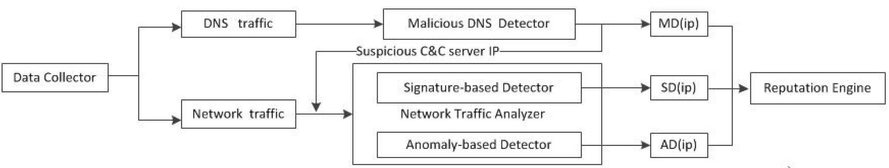
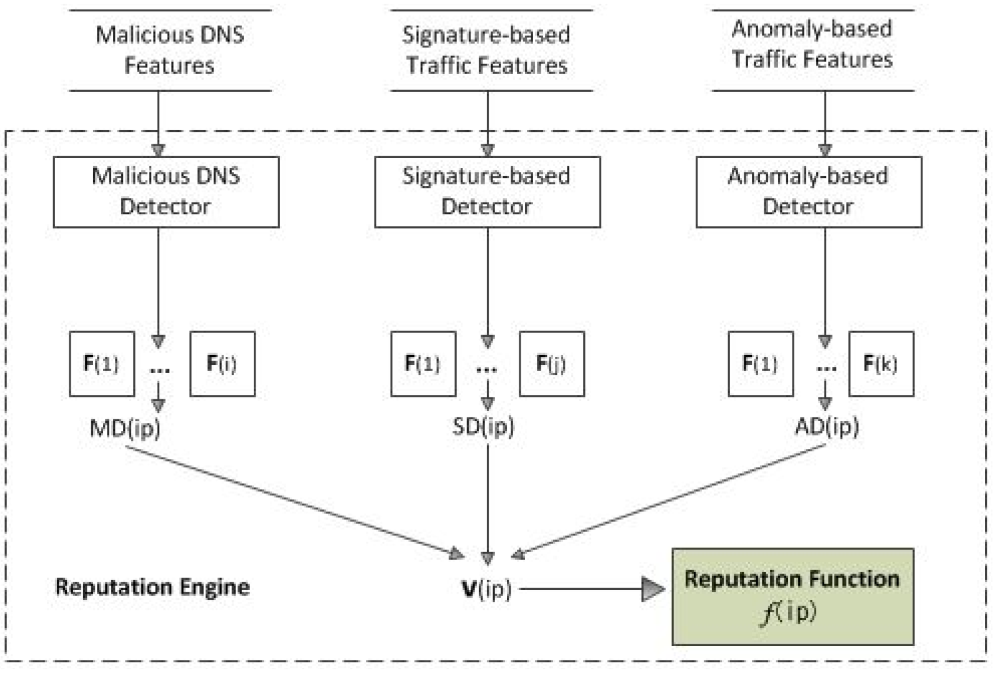
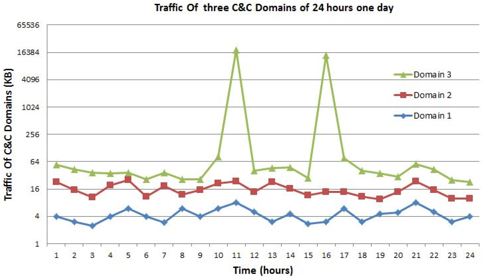
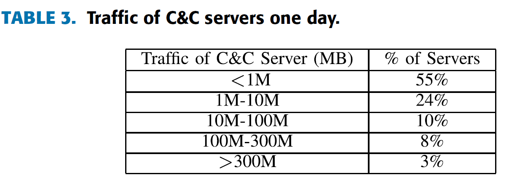

Detecting APT Malware Infections Based on Malicious DNS and Traffic Analysis (IDnS)
===================================================================================
@(Research Notebook)[apt, malware, dns, ids, network, data mining]

----

[TOC]

----

### Abstract

> Advanced persistent threat (APT) is a serious threat to the Internet. With the aid of APT malware, attackers can remotely control infected machines and steal sensitive information. DNS is popular for malware to locate command and control (C&C) servers. In this paper, we propose a novel system placed at the **network egress point** that aims to efficiently and effectively detect APT malware infections based on malicious DNS and traffic analysis. The system uses `malicious DNS analysis techniques to detect suspicious APT malware C&C domains`, and then `analyzes the traffic of the corresponding suspicious IP using the signature-based and anomaly based detection technology`. We extracted **14** features based on big data to characterize different properties of malware-related DNS and the ways that they are queried, and we also defined network traffic features that can identify the traffic of compromised clients that have remotely been controlled. We built a reputation engine to compute a reputation score for an IP address using these features vector together. Our experiment was performed at a large local institute network for two months, and all the features were studied with big data, which includes 400 million DNS queries. Our security approach cannot only substantially reduce the volume of network traffic that needs to be recorded and analyzed but also improve the sustainability of the system.

----

### System Architecture

#### Module 1: Data Collector

> It is placed at the network edge to record the inbound and outbound traffic produced by the network.

#### Module 2: Malicious DNS Detector:

> It is responsible for analyzing the inbound and outbound DNS traffic produced by the network, and detecting **suspicious APT malware C&C domains**.

#### Module 3: Network Traffic Analyzer

> 1. signature-based detector
>> The signature-based detector has defined C&C communication traffic signatures for detecting malware known to the system.

> 2. anomaly-based detector
>> The anomaly-based detector detect anomalous behaviors including protocol anomaly, statistical anomaly, application anomaly etc.

#### Module 4: Reputation Engine

> It aims to compute a reputation score for an IP address to judge whether the host or server owning the IP address is infected or not, by using malicious DNS and network traffic feature vectors together.

> The reputation engine is responsible for detecting whether a host inside the network with IP address *i* has behaviors that are similar to a infected host or not.

> The reputation score is assigned **between 0 and 1**. Score **0 represents low reputation** (it means **malware infected**) and score **1 represents high reputation** (it means **not infected**).

> Malicious DNS detector module, signature-based detector module and anomaly-based detector module will compute three output vectors *MD(IPi)*, *SD(IPi)* and *AD(IPi)*, respectively.

> Three feature vectors will be concatenated into one feature vector *V(ipi)*. V(ipi) will be fed into the trained reputation function.

> $$ L = \{(V(ip_i)), y_i\} _i =_1.._n. $$
> If $ip_i$ is a confirmed infected host, $y_i$ = 0, otherwise $y_i$ = 1.

----

### Malicious DNS Features

Table 1: Feature set to detect APT malware C&C domains (* = new features).

| FeatureSet                 | \#. | FeatureName                                  |     |
| :------------------------: | :-: | :------------------------------------------: | :-: |
| Domain Name-Based Features |   1 | Contain Famous Name                          |  *  |
|                            |   2 | Contain particular name                      |  *  |
|                            |   3 | Contain phishing name                        |  *  |
| DNS Answer-Based Features  |   4 | Silent IP                                    |  *  |
|                            |   5 | Number of distinct IP addresses              |     |
|                            |   6 | Number of distinct countries                 |     |
|                            |   7 | Number of domains share the same IP with     |     |
|                            |   8 | IP in the same Class B range of known C&C servers ||
| Time Value-Based Features  |   9 | Daily similarity                             |     |
|                            |  10 | Same query numbers in same time window       |     |
|                            |  11 | Very low frequency query                     |     |
| TTL Value-Based Features   |  12 | Average TTL                                  |     |
| Avtive Probe Features      |  13 | Web server or not                            |     |
|                            |  14 | Whois information                            |     |

#### Contain Famous Name

> Many registered suspicious dynamic domain names contain famous domain names such as **windows**, **yahoo** and **taobao**. And we know that there is little chance that these dynamic domains are used for **Microsoft**, **Yahoo** or **Alibaba**.

#### Contain Particular Name

> Many dynamic domain names registered for C&C servers contain some particular name, such as **"web",  "mail", "news"'** and **"update"**. Make these domains more like normal ones.

> And as observed, the particular name and the famous domain name are usually used together, such as **"yahoomail.xxx.com", "yahoonews.xxx.com"** and **"windowsupdate.xxx.com"**.

#### Contain Phishing Name

> Phishing domain has a similar name to a legitimate one. Such as **"youtuhe.com"** compared to **"youtube.com"**, **"yah00.com"** compared to **"yahoo.com"**, etc.

#### Silent IP

> To hide the C&C server and C&C network traffic, when attackers do not need to send commands to a victim machine, they do not want the domain names to point to the C&C server. For that moment, attackers usually change the domains to point to some specic IPs. Specific IP addresses are usually as follows:
- **127.0.0.1** (loop back address)
- **192.168.x.x**, **172.16.x.x**, **10.x.x.x** (private address)
- **x.x.x.255** (broadcast address).

> ##### Predefined IP
When the domain is resolved to the predefined IP, the malware would turn to silent-mode and would not initiate a connection until the domain is resolved to another IP address. Predefined IP addresses are usually some invalid IP addresses that have obvious features, such as **5.5.5.5, 2.3.3.2**.

#### Number of Distinct IP Addresses && Number of Distinct Countries

> Attackers usually use servers reside in different countries or regions they control or manage as C&C servers.

> If C&C servers reside in the *same country of the victim*, it is easier for the victim country to analyze this attack.
> If C&C servers reside in the *same country of the attacker*, it is easier to trace the real source.

#### Number of Domains Share the Same IP with

> In the APT attack scenario, a single attacker seldom own more than **30** dynamic names to locate command and control server in the same time, because it is not necessary and it is hard to maintain them.

#### IP in the Same Class B Range of Known C&C Servers

> There are many C&C servers in the same **Class B** IP addresses range and even in the same **Class A** range.
1. There are more and more APT attackers rent **VPS servers** as C&C servers. Because VPS server is stable, hard to trace back and easy to manage. VPS servers rented from the same service provider are mostly in the same Class B IP addresses range and even in the same Class A range.
2. Some advanced attackers constructed special network for C&C servers.

#### Daily Similarity

> Check if there are domains that show **daily similarities in their request count change over time,** an increase or decrease of the request count at the same intervals everyday.

> Organized APT attackers usually change the domains to point to C&C servers at the start time of one-day work hours, and change the domains to point to silent IP at the end time of one-day work hours.

> Some malware typically connect to C&C servers at same intervals of everyday, monitoring consistent intervals for DNS requests will help.

#### Same Query Numbers in Same Time Window

> This feature means in the same time window, the number of domain queries are about the same. When the infected host is online, but there is a connection failure for some reason. The infected host will mistaken DNS errors and send large amounts of repeated DNS queries. (**NXDomains**)

#### Very Low Frequency Query

> We found that a few high advanced APT malware query domains to locate command and control server at very low frequency, at one time for serval days or even serval weeks.

> Most of the domains are all web servers, and these web servers have common features in website content and design as well. The resolving **IP address** and **Time To Live (TTL)** of the domain name are all stable.

#### Average TTL

> Setting TTL values of host names to lower values can help the attacker to change the C&C server rapidly. Moreover, based on our measurements, TTL values of Dynamic Domain Name Service, such as **DynDNS, NO-IP and ChangeIP**, are usually set to **30, 31, 60, 300** seconds. Not all the malware C&C domains set TTL values to lower values.

#### Web Server or Not

> Probe domain's **80 port** and check it is a true web server or not. If a domain keep TCP port 80 open but not a web server, it is highly suspicious.

#### Whois Information

> By querying Whois, we can get more information of the domain name, such as :
1. the registration date,
2. the registrar,
3. the registrant name,
4. the registrant email and
5. the registered country.

> Comparing these information with the whois information of previous known malware C&C domains is an effective method.

----

### Network Traffic Features

Table 2: Feature set to detect APT malware C&C traffic (* = new features).

| FeatureSet                   | \#. | FeatureName                                |     |
| :--------------------------: | :-: | :----------------------------------------: | :-: |
| Signature-Based Detection Features |  1 | VRT Rule sets: malware-backdoor rules |     |
|                                    |  2 | VRT Rule sets: malware-cnc rules      |     |
|                                    |  3 | VRT Rule sets: malware-other rules    |     |
|                                    |  4 | VRT Rule sets: blacklist rules        |     |
|        |  5 | Target Malware (TM) Family Rule sets: 21 unknown malware (HTTP/HTTPS) |*|
| Anomaly-Based Detection Features| 6| Mismatch of protocol and port (Protocol Anomaly)||
|        |  7 | Encrypted data transpire on uncommonly-used port (Protocol Anomaly)    ||
|        |  8 | Mismatch of uplink and downlink traffic (Statistical Anomaly)     |     |
|        |  9 | A number of small packets in long TCP connection (Statistical Anomaly)| |
|        | 10 | Heartbeat packet traffic (Application Anomaly)                    |     |
|        | 11 | Malware domain traffic (Observation Anomaly)                      |     |

#### VRT Rule Sets

> Ruleset plays a crucial role in signature-based IDS, and the number and accuracy of the rules determine how much infections can be detected. Our system focuses on detecting malware infections, so the rules applied to the system are mainly from
1. malware-backdoor rules,
2. malware-cnc rules,
3. malware-other rules and
4. blacklist rules.

#### Target Malware (TM) Family Rule Sets

> By analyzing the network traffic produced when the malware communicate with command and control servers, we extract network traffic communication features of **21 unknown malware or trojans**.

> We attribute the unknown malware to our **TM (Targeted Malware) family**, So all the malware in our TM (Targeted Malware) family can be habitually detected. For example:
- TM1 has consistent URL parameters **"GET/1/login.php?uDYmFsY2sD&pDcGFzc3dvcmQyMDE1 HTTP1.1"**.
- TM2 has regular URL parameters **"GET/{6characters}.php?idD{12 characters} HTTP1.1"**, the 12 characters string is the encrypted MAC address of the infected machine.

> Analyzing HTTP headers is a useful generic way to detect malware communications, such as
- **URL parameters,**
- **Content-type,**
- **Content-Length and**
- **User-Agent in HTTP POST/GET request.**

#### Mismatch of Protocol and Port (Protocol Anomaly)

> For tunneling through the firewall of target network, the malware usually uses C&C communication protocols and ports that are allowed by the firewall. As observed, the most popular ports on which the malware communicate with theC&C servers are **80, 8080, 443, 8000, 1863**, etc. The most popular protocols via which the malware communicate with the C&C servers are **HTTP** and **HTTPs**.

> For example, HTTP protocol traffic occurs not on port 80 or 8080, or non-HTTP protocol traffic occurs on port 80. They are all very likely malicious traffic.

#### Encrypted Data Transpire on Uncommonly-Used Port (Protocol Anomaly)

> Some malware sometimes communicate with the C&C servers on ports which are seldom used by legitimate applications. And most APT malware C&C traffic data is encrypted to evade detections. **So encrypted data transpire on uncommonly-used protocol port is also likely malicious traffic**.

#### Mismatch of Uplink and Downlink Traffic (Statistical Anomaly)

> Normally, **the downlink data traffic ow to host is larger than the uplink traffic to server**. But the C&C communicating traffic is diametrically opposite. The data traffic that infected host upload to the control server is always larger than the data traffic received from the control server.

> For example, traffic of HTTP request much more than the HTTP response is very likely malicious traffic.

#### A Number of Small Packets in Long TCP Connection (Statistical Anomaly)

> When the attacker send sets of command to the infected machine, commands such as file resource search command, file download command would require a lot of waiting time, **coupled with the human thinking time, make the connection session a longer duration**. And sets of commands are all small packets sent from C&C server to the infected host.

####  Heartbeat Packet Traffic (Application Anomaly)

> After the infected host client connected the command and control server, the **server would send packets to the client, making sure the other end is on line**. This kind of packet is called **heartbeat packet**.

> As heartbeat *packets have similar size*, we cluster all packets by packet size and **check whether packets in the same cluster are sent periodically**.

#### Malware Domain Traffic (Observation Anomaly)

> The traffic of C&C server is smooth and small at most of the time, but has peak values when attacker were uploading data from infected hosts to the C&C server.

> 

----

### Evaluation

> A statistics of the traffic of 200 C&C servers we have identified. It illustrates that C&C server IP has a small volume of traffic per day under normal circumstances, and the network traffic analyzer of the system only needs to analyze very less traffic.

> 
