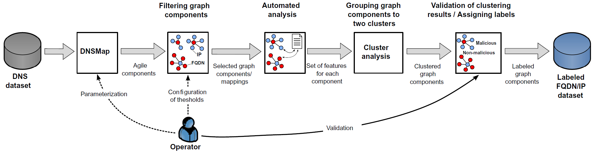
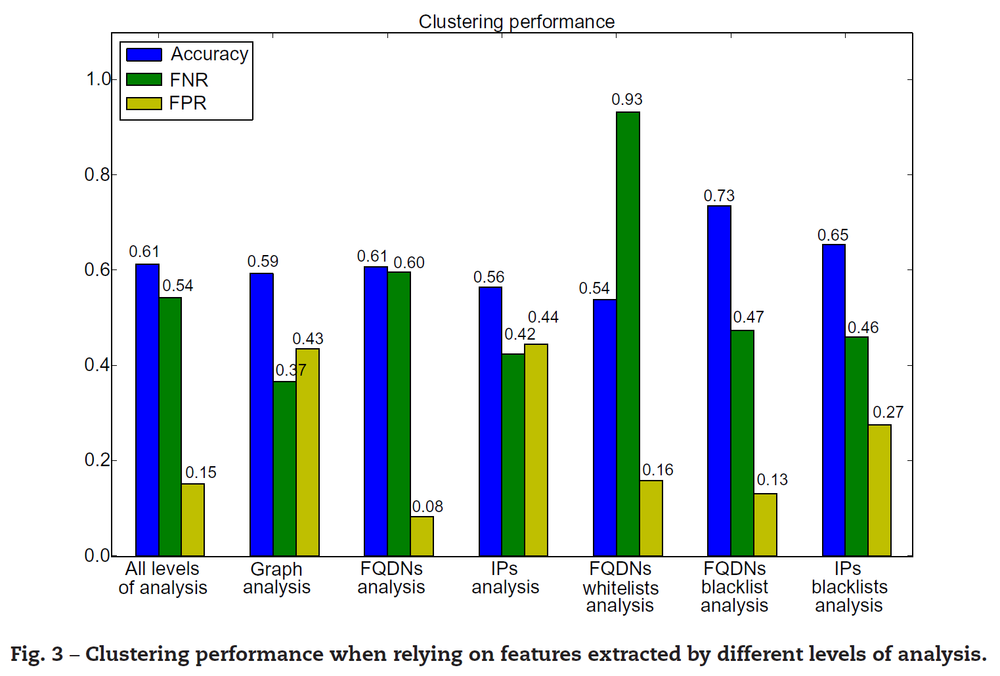
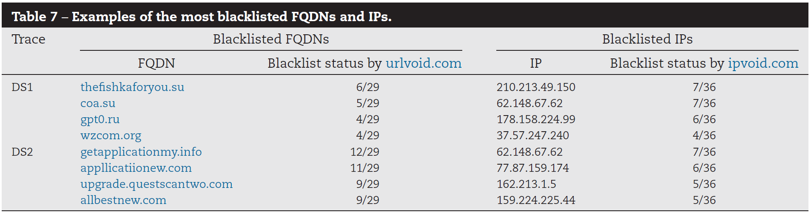
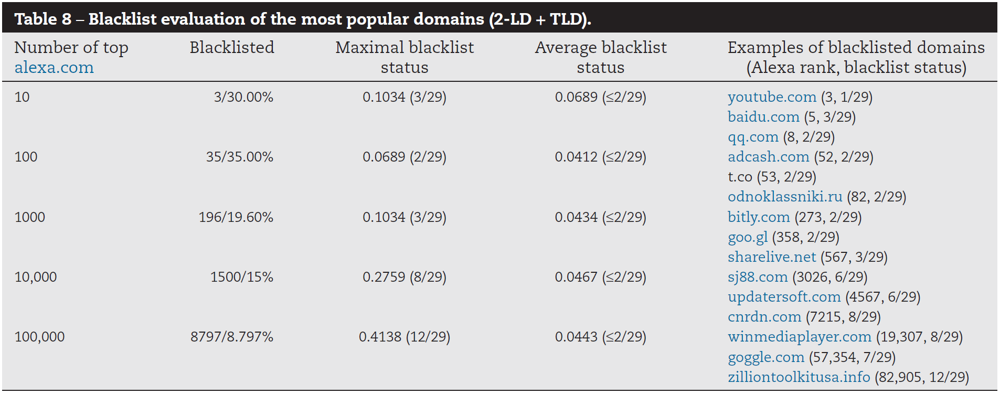

On the Ground Truth Problem of Malicious DNS Traffic Analysis
=============================================================
@(Research Notebook)[malware, dns, blacklist, whitelist, machine learning, network, semi-manual labeling, dga, flux]

----

[TOC]

----

### Abstract

> DNS is often abused by Internet criminals in order to provide flexible and resilient hosting of malicious content and reliable communication within their network architecture.**The majority of detection methods targeting malicious DNS traffic are data-driven**, most commonly having machine learning algorithms at their core. These methods require accurate ground truth of both malicious and benign DNS traffic for model training as well as for the performance evaluation. This paper elaborates on the problem of obtaining such a ground truth and evaluates practices employed by contemporary detection methods. Building upon the evaluation results, we propose **a novel semi-manual labeling practice targeting `agile DNS` mappings**, i.e. DNS queries that are used to reach a potentially malicious server characterized by fast changing domain names or/and IP addresses.The proposed approach is developed with the purpose of obtaining ground truth by incorporating the operator’s insight in efficient and effective manner. We evaluate the proposed approach on a case study based on DNS traffic from an ISP network by comparing it with the popular labeling practices that rely on **domain name and IP blacklists** and **whitelisting of popular domains**. The evaluation indicates challenges and limitations of relying on existing labeling practices and shows a clear advantage of using the proposed approach in discovering a more complete set of potentially malicious domains and IP addresses. Furthermore, the novel approach attains time-efficient labeling with limited operator’s involvement, thus is promising in view of the adoption in operational ISP networks.

----

### A Novel Semi-Manual Labeling Approach

#### Phase 1: DNSMap

> DNSMap’s main objective consists of **providing an adaptive characterization of this `agility`**.

> The approach **tracks FQDNs and corresponding IPs**, within an initial learning period, in order to get an understanding of typical DNS activity for observed FQDNs and IPs.

> All suspicious mappings in a certain analysis period are analyzed as `bipartite graphs`, where **FQDNs and IPs are nodes, and edges indicate the existence of a suspicious mapping between them**.

#### Phase 2: Filtering graph components

> Select graph components that are most interesting for our analysis

> The main goal of this phase is to **prune the graph components** isolated by the DNSMap in order to **filter out less agile graph components** and select the ones that are more likely to facilitate malicious services.

> Malicious traffic has to **move across several FQDNs and IPs in the attempt of avoiding to be blocked**, therefore exhibiting the agile behavior.

> The **agility of DNS** traffic can be broadly quantified with **the number of FQDNs and IPs** that were used within the period of observation.

> define "interesting" graph components as ones with `at least 40 FQDNs` or `at least 20 IPs` while having their `IPs belonging to at least 2 Autonomous Systems (ASs)`

#### Phase 3: Automated analysis

> Automated analysis is used for characterizing the graph components returned by the filtering phase. This phase **extracts a number of features for each of the selected graph components**. The features were designed leveraging both **theoretical knowledge** and **empirical evidence** on the actual behavior of malicious traffic. The features can be can be grouped in 6 categories corresponding to different types of analysis performed on the graph components.

#### Phase 4: Cluster analysis

> Cluster Analysis groups graph components into **two clusters representing malicious and non-malicious components**.

> The cluster analysis is implemented using `K-means clustering algorithm`.

> Defined **32 features** that will be considered for the task of clustering graph components

#### Phase 5: Assigning provisional labels

> We assume that a **malicious cluster has a higher average number of blacklisted FQDNs per graph component than non-malicious cluster**. Therefore, a cluster is marked as malicious if it fulfills the assumption.

> Blacklists represent important indicators of the maliciousness of FQDNs and IPs

#### Phase 6: Manual validation

> This phase is one of the key elements of the proposed approach as it **incorporates human insight** into the labeling process.

> The main task of the operator is to **go though all graph components extracted by the system and check the provisional labels** assigned in the previous step.

> In some cases there are no sufficient evidence or there are contradictory indications from different analysis steps, so the operator needs to perform further investigation. This might include different actions such as **searching the web for security reports for particular FQDNs/IPs** and resolving a subset of FQDNs in a browser.

----

### Features in 6 categories corresponding to different types of analysis

Table 1: Features extracted for each agile graph component.

| Type of analysis         | Features                                                                |
| :----------------------- | :---------------------------------------------------------------------- |
| Graph analysis           | Number of IPs                                                           |
|                          | Number of FQDNs                                                         |
|                          | Max degree of IP nodes                                                  |
|                          | Max degree of FQDN nodes                                                |
|                          | Max FQDN node betweenness for IP nodes                                  |
|                          | Max IP node betweenness for FQDN nodes                                  |
| FQDN analysis            | Max number of tokens (n-LD)                                             |
|                          | Number of distinct suspicious TLDs                                      |
|                          | Max length of 2-LD                                                      |
|                          | Max length of 3-LD                                                      |
|                          | Max number of numeric characters                                        |
|                          | Max number of words (English)                                           |
|                          | Share of the most frequent 2-LD                                         |
|                          | Share of the most frequent 3-LD                                         |
| IPs analysis             | Number of ASs                                                           |
|                          | Number of trustworthy ASs                                               |
|                          | Number of distinct hosting countries                                    |
|                          | Average distance between hosting countries                              |
|                          | Number of suspicious countries                                          |
|                          | IPDistScore – measure of IP scatteredness                               |
| FQDNs whitelist analysis | Number of whitelisted FQDNs in top 10000 alexa.com most popular domains |
|                          | The most frequent 2-LD in top 1000 alexa.com most popular domains       |
| FQDNs blacklist analysis | Number of blacklisted FQDNs                                             |
|                          | Average FQDNs blacklist status                                          |
|                          | Max FQDNs blacklist status                                              |
|                          | Number of blacklisted 2-LD + TLD                                        |
|                          | Average 2-LD + TLD blacklist status                                     |
|                          | Max 2-LD + TLD blacklist status                                         |
| IPs blacklist analysis   | Number of blacklisted IPs                                               |
|                          | Average IPs blacklist status                                            |
|                          | Max IPs blacklist status                                                |
|                          | Number of "active" IPs                                                  |

#### Graph analysis

Graph analysis **examines connections between edges in graphs** to recognize connectivity pattern that characterize common hosting/fast-flux/domain-flux. The main assumption is that `the malicious FQDNs-to-IPs mappings are characterized by a specific graph structure`.

> - Number of FQDN/IP nodes.
> > **Bigger graph components** are more likely linked to malicious behavior, as they **represent more agile mappings** within the analysis period.

> - Maximum degree of FQDN/IP nodes
> > **IP-flux and domain-flux** are characterized by a **high maximal value of the degree of FQDN and IP nodes**, respectively. The degree of a node of a graph is the number of edges incident to the node, with loops counted twice.

> - Maximum FQDN/IP node betweenness.
> > **Node betweenness is a global centrality measure that quantifies importance of a particular vertex in a graph.** Node betweenness is equal to **the number of shortest paths from all vertices to all others that pass through that node.** `IP-flux` is characterized by a high maximal value of IP node betweenness for `a specific FQDN node`, while `domain-flux` is characterized by a high maximal value of FQDN node betweenness for `a specific IP node`.

#### FQDNs analysis

FQDNs analysis `examines domain names within the graph component in order to check if there are some suspiciously looking pseudo-random domains` that are often associated with malicious services.

> - Number of tokens (n-LDs).
> > Many legitimate services rely on FQDNs with more than **3 levels**.

> - Suspicious TLDs.
> > Indication if some of **the 50 most famous TLDs associated with malicious activity** are present in the graph component.

> - 2-LDs/3-LDs features:
> > - **Number of English words in 2-LDs/3-LDs.** Pseudo-random domains are characterized by smaller number of words within them.
> > - **Number of numerical characters in 2-LDs/3-LDs.** Pseudo-random domains are characterized by higher number of numerical characters.
> > - **Length of 2-LDs/3-LDs.** Malicious pseudo-random domains often have long pseudo-random 2-LDs or 3-LDs.

> - Share of the most frequent 2-LDs/3-LDs within the graph component.
> > Situation in which **a specific 2-LD or 3-LD dominate within the graph component** i.e., when the majority of domains share the same 2-LD or 3-LD, is usually associated with legitimate services.

#### IPs analysis

IPs analysis `examines IPs within the graph component`. The main assumption is that `IPs are more diverse within the malicious graphs`.

> - Number of ASs.
> > **High number of ASs to which IP addresses within the graph component belong to** is often associated with malicious DNS strategies.

> - Trustworthy ASs.
> > **Trustworthy ASs are those ones belonging to some well-known service providers**. Benign graph components usually have IPs hosted by trustworthy ASs.

> - Number of countries.
> > Malicious services are usually hosted over **a high number of countries**.

> - Geographical distance between hosting countries.
> > Malicious graph components are often characterized by **greater distances between countries in which their IPs are hosted**.

> - Suspicious countries.
> > Indication if **IPs are hosted in some of the 25 well-known countries for hosting malicious domains**.

> - Scatterness of IPs.
> > **Malicious hosting often uses IP addresses that are scattered over multiple networks**.

#### FQDN whitelist analysis

FQDN whitelist analysis `examines if popular domains are present in the analyzed graph component`. The main assumption is that `the presence of popular domains can indicate that the graph component is benign`.

> - Number of whitelisted domains.
> > Graph component contains **a substantial number of popular domains that are often non-malicious**.

> - Top 2-LD whitelisted.
> > If **a specific 2-LD dominates within the graph component** and if **it is within the most popular domains**, then the component is most likely non-malicious.

#### FQDN blacklist analysis

FQDN blacklist analysis `checks if FQDNs within the graph component are blacklisted`. The main assumption is that `malicious components are characterized by a number of blacklisted domains`.

> - Number of blacklisted FQDNs.
> > A graph component could be considered malicious if **a certain number of FQDNs within it are blacklisted**.

> - Number of blacklisted 2-LD + TLD.
> > A graph component could be considered malicious if **a certain number of 2-LDs +TLDs within it are blacklisted**.

> - Blacklist status.
> > A graph component could be considered malicious if **FQDNs within it are blacklisted by a substantial number of blacklists**. We define Blacklist Status as **a ratio of the number of blacklists that flagged certain FQDN and the total number of checked blacklists**.

#### IP blacklist analysis

IP blacklist analysis `checks if IPs within the graph component are blacklisted.` The main assumption is that `malicious components are characterized by a number of blacklisted IPs`.

> - Number of blacklisted IPs.
> > A graph component could be considered malicious if **a certain number of IPs within it are blacklisted**.

> - Blacklist status.
> > A graph component could be considered malicious if **IPs within it are blacklisted by a substantial number of blacklists.** We define Blacklist Status as **a ratio of the number of blacklists that flagged certain IP and the total number of checked blacklists.**

> - "Active" IPs.
> > A graph component is considered malicious if b**lacklisted IPs were observed in malicious context in the same period** when the trace was recorded.

----

### Evaluation

#### Performance of cluster analysis

> **Identifying the minimal set of features** that could provide us with the most accurate clustering.

> The highest accuracy was achieved by **using the set of features extracted by FQDN blacklist analysis**, where over 73% of graph components were clustered correctly.

> The worst performance were obtained when relying on features from IP analysis and FQDN whitelist analysis having an accuracy close to random choice.

> Malicious and non-malicious services are often relying on the same agile DNS strategies such as Fastflux and Domain-flux.

> 

#### Evaluating blacklisting practices

> We can conclude that over 75% of the blacklisted FQDNs/IPs are listed by only one blacklist.

> 

#### Evaluating whitelisting practice

>  The relatively high percentage of popular domains have been blacklisted

> 

