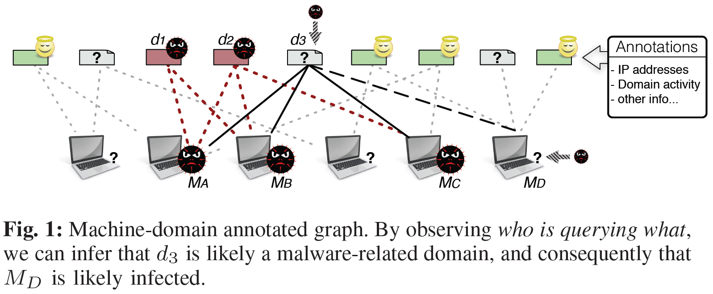
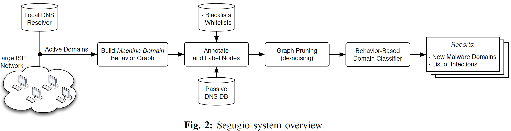
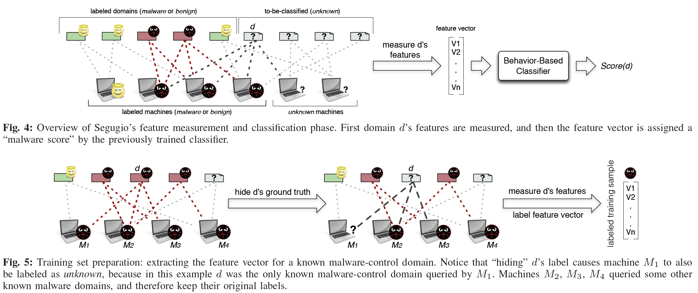

Segugio: Efficient Behavior-Based Tracking of Malware-Control Domains in Large ISP Networks
===========================================================================================
@(Research Notebook)[malware, dns, machine learning, network]

----

[TOC]

----

### Abstract

> In this paper, we propose Segugio, a novel defense system that allows for efficiently **tracking the occurrence of new malware-control domain names in very large ISP networks**. Segugio **passively monitors the DNS traffic to build a machine-domain `bipartite graph` representing `who is querying what`**. After labeling nodes in this query behavior graph that are known to be either benign or malware-related, we propose a novel approach to accurately detect previously unknown malware-control domains.

> We implemented a proof-of-concept version of Segugio and deployed it in large ISP networks that serve millions of users. Our experimental results show that Segugio can **track the occurrence of new malware-control domains** with up to 94% true positives (TPs) at less than 0.1% false positives (FPs). In addition, we provide the following results: (1) we show that Segugio can also **detect control domains related to new, previously unseen malware families**, with 85% TPs at 0.1% FPs; (2) Segugio’s detection models learned on traffic from a given ISP network can be deployed into a different ISP network and still achieve very high detection accuracy; (3) new **malware-control domains can be detected days or even weeks before they appear in a large commercial domain name blacklist**; and (4) we show that Segugio clearly outperforms Notos, a previously proposed domain name reputation system.

> 

### System Overview

> Segugio is based on the following main intuitions:
> (1) in time, **infected machines tend to query new malware-related domains**;
> (2) **machines infected with the same malware family tend to query partially overlapping sets of malware-control domains**; and
> (3) **benign machines have no reason to query domains that exist for the sole purpose of providing “malware-only” functionalities**.

> 

#### Machine-Domain Behavior Graph

> Segugio **monitors the DNS traffic** between the machines in a large ISP network and their local DNS server, for a given observation time window T (e.g., one day).

> Accordingly, it **constructs a machine-domain graph** that describes `who is querying what`. Notice that we are only interested in authoritative DNS responses that map a domain to a set of valid IP addresses.

> Segugio builds an **undirected bipartite graph G = (M;D;E)** that captures the DNS query behavior of machines in the ISP network.

> Nodes in the **set M represent machines**, whereas **nodes in D represent domain names.** A machine $m_i \in M$  is connected to a domain $d_j \in D$ by an edge $e_{ij} \in E$, if $m_i$ queried $d_j$ during the observation window *T*.

#### Node Annotations and Labeling

> We augment each domain node $d_j \in D$ by recording the set of IP addresses that the domain pointed to during the observation window *T* (as collected from the live DNS traffic). In addition, we estimate how long ago (w.r.t. to *T*) the domain was first queried.

> Label machine and domain nodes as either **malware, benign, or unknown.**
> > Specifically, by leveraging a small number of **public and private malware C&C domain blacklists**, we can first label known malware-control domains as malware. To label benign domains, we leverage the **top one-million most popular second-level domains according to alexa.com.**
> > Specifically, we label as benign those **domains whose effective second-level domain consistently appeared in the top one-million alexa.com** list for about **one year**.
> > Notice also that we take great care to **exclude certain “free registration” second-level domains from our whitelist**, such as **dynamic DNS domains**, **blog domains**, etc., because subdomains of these second-level domains can be freely registered and are very often abused.

> All remaining domains are labeled as unknown, since we don’t have enough information about their true nature.

#### Graph Pruning

> To boost performance and reduce noise, we prune the graph using the following conservative rules:

> - (R1): We identify and discard machines that are essentially “inactive”, because it is unlikely that they can help our detection system. To be conservative, we only **filter out machines that query $\leq$ 5 domains**.

> - (R2): In our ISP test networks, we observed a number of machine nodes that likely represent **large proxies or DNS forwarders serving** an entire enterprise network. **Such devices appear as nodes with very high degree**, and tend to introduce substantial levels of “noise”. We therefore filter them by discarding all machines that query $\geq \theta_d$ domains. Empirically setting $\theta_d$ to be the 99.99-percentile of the distribution of number of domains queried by a machine was sufficient to remove these outlier machines.

> - (R3): The graph G may contain a **number of domain nodes that are queried by only one or very few machines.** Because we are primarily interested in detecting malware domains that affect a meaningful number of victim machines, we discard all domain names that are queried by only one machine.

> - (R4): **Very popular domains**, i.e., domains that are queried by a very large fraction of all machines in the monitored network, are unlikely to be malware-control domains.
> Discard all domain names whose effective second-level domain is queried by $\geq \theta_m$ machines, where $\theta_m$ is conservatively set to **1/3 of all machines** in the network, in our experiments.

#### Behavior-Based Classifier

> Let C be Segugio’s domain classifier trained during a traffic observation window $T_1$ (the training process is explained later in this section). Our main objective is to use C to classify unknown domains observed in DNS traffic from a different time window $T_2$. To this end, we first build a machine-domain graph $G_{T_2}$ on traffic from $T_2$.

> Then, for each unknown (i.e., to be classified) domain $d \in G_{T_2}$ , we measure the statistical features defined earlier, as shown in Figure 4. Then, we input d’s feature vector into the previously trained classifier C, which computes a malware score for d. If this score is above a (tunable) detection threshold, we label d as malware.

> 

### Features

Table 1: Domain Features

| FeatureSet       | Feature                                                |
| :--------------- | :----------------------------------------------------- |
| Machine Behavior | The fraction of known infected machines that query $d$ |
|                  | The fraction of "unknown" machines that query $d$      |
|                  | The total number of machines                           |
| Domain Activity  | The total number of days in which $d$ was actively     |
|                  | queried within the time window [$t_{now}- t_{past}$]   |
|                  | The number of consecutive days ending with $t_{now}$   |
|                  | in which $d$ was queried                               |
| Domain Activity  | The total number of days in which second-level domain  |
|                  | of $d$ was actively queried within the time window     |
|                  | [$t_{now}- t_{past}$]                                  |
|                  | The number of consecutive days ending with $t_{now}$   |
|                  | in which second-level domain of $d$ was queried        |
| IP Abuse         | The fraction of IPs in $A$ that were associated to     |
|                  | known malware domains during $W$                       |
|                  | For each IP in $A$ we consider its /24 prefix, and     |
|                  | measure the fraction of such prefixes that match an IP |
|                  | that was pointed to by known malware domains during $W$|
| IP Abuse         | The fraction of IPs in $A$ that were associated to     |
|                  | unknown domains during $W$                             |
|                  | For each IP in $A$ we consider its /24 prefix, and     |
|                  | measure the fraction of such prefixes that match an IP |
|                  | that was pointed to by unknown domains during $W$      |

#### Machine Behavior

> Let *S* be the set of machines that query domain *d*, $I  \subseteq S$ be the subset of these machines that are known to be infected (i.e., are labeled as **malware**), and $U  \subseteq S$ be the subset of machine labeled as unknown.

> - the fraction of known infected machines: $m = |I| / |S|$
> - the fraction of "unknown" machines: $u = |U| / |S|$
> - the total number of machines: $ t = |S|$

> These features try to capture the fact that
> - **the larger the total number t and fraction m of infected machines that query d**,
> - **the higher the probability that d is a malware-control domain**.

#### Domain Activity

> Intuitively, **newly seen domains** are more likely to be malware-related, if they are **queried mostly by known malware-infected machines**. **Registration information** may be of help, but some malware domains may have a long registration period and remain “dormant” for some time, waiting to be used by the attackers.

> Let $t_{now}$ be the day in which the graph G was built, and $t_{past}$ be $n$ days in the past, w.r.t. $t_{now}$ (e.g., we use n = 14 in our experiments).

> - the total number of days in which d was actively queried within the time window [$t_{now}- t_{past}$]
> - the number of consecutive days ending with $t_{now}$ in which $d$ was queried.

> We similarly measure these two features for the effective second-level domain of d.

#### IP Abuse

> **Let A be the set of IPs to which d resolved during our observation window T**. We would like to know how many of these IPs have been pointed to in the past by already known malware-control domains. To this end, we **leverage a large passive DNS database**.

> - We consider a time period W preceding $t_{now}$ (e.g., we set W = 5 months, in our experiments).
> - For each IP in A we consider its /24 prefix, and measure the fraction of such prefixes that match an IP that was pointed to by known malware domains during W.

> Similarly, we measure the number of IPs and /24’s that were used by unknown domains during W.
